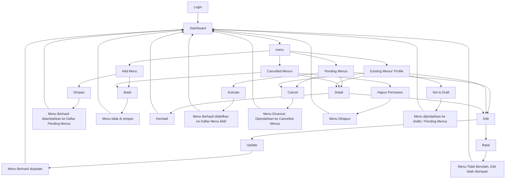

# CRUD MENU
_Documentation by Elva Gracia 231510001_

---

## I. Apa aja yang dikerjakan
- Create Menu
- Read Menu
- Update Menu
- Delete Menu
- Status Menu

## II. Tabel Menu
Dalam pembuatan CRUD Menu, ada dibuat Tabel `Menu` 

|Column | Type  | Note |
|------ |-------|------|
| `id`	| int(11) Auto Increment	| id menu, Primary Key |
| `id_kategori`	| int(11) unsigned	| Foreign Key ke Tabel Kategori |
| `nama`	| varchar(255)	| Nama Menu |
| `deskripsi`	| text	| Deskripsi Menu |
| `harga`	| decimal(10,0)	| harga menu |
| `status_id` |	int(2)	| Status Menu. Cth: 1 Pending, 5 Active, 8 Cancel, 20 Terposting |
| `url_gambar` |	varchar(255)	| untuk menyimpan link/path foto menu |
| `created_by` |	int(11)	| menyimpan ID user yang membuat data ini |
| `created_at` |	timestamp [current_timestamp()]	| agar mencatat waktu pembuatan secara otomatis. |

**NOTES 
**
Setting untuk Foreign Key id_kategori 

`ON DELETE = "RESTRICT"`. Tidak bisa menghapus kategori jika masih ada menu yang menggunakan kategori tersebut. 

`ON UPDATE ="CASCADE"`. Kalau id_kategori berubah, maka nilai di tabel menu ikut berubah.

## III. Diagram of CRUD Menu

---

>### ADDITIONAL NOTES
>1. FEATURE TEST

> Untuk tes fitur. untuk Sementara, karena scope Kategori belum ada di dalam git proyek, bisa di tambahkan dulu manual Kategori di database, baru tes kembali.
>2. ERROR TO BE FIXED

> *ada masalah navigasi ketika klik set to draft, (will be fixed soon)

> *tambah kategori untuk sementara juga belom bisa karena scope kategori blom selesai (will be fixed soon)

