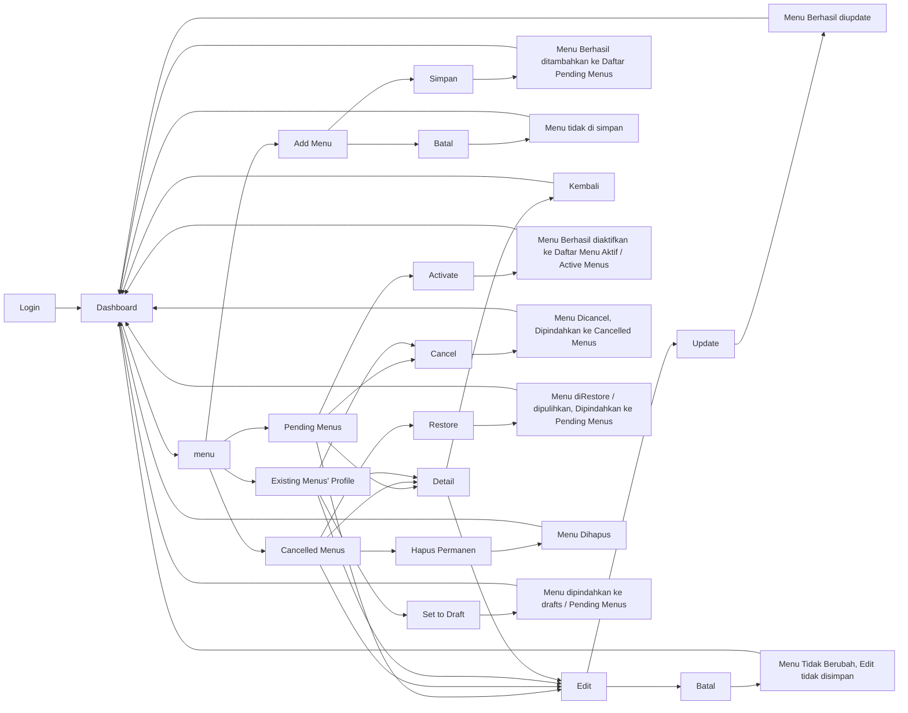

# CRUD MENU

**Documentation by Elva Gracia 231510001** 

*Updated in 8 July 2026*

---

**NEW UPDATES** 
| Date | Whats New |
|------|-----------|
| 08/07/26 | Perbaikan Navigasi Menu: Return-to-Origin Redirect & Restore Feature |

---

## A. Apa aja yang dikerjakan
1. Manajemen Menu — membuat sistem tambah, lihat, edit, dan hapus menu makanan, termasuk upload gambar menu ke server.
2. Status Menu — menerapkan alur status menu (Pending → Active/Cancel → Delete), sehingga menu baru otomatis masuk status "Pending" sebelum diaktifkan, dan hanya menu berstatus "Cancel" yang bisa dihapus permanen.
3. Validasi Input — menambahkan validasi untuk nama, deskripsi, harga, dan kategori menu agar data yang masuk konsisten.
4. Perbaikan Navigasi — menambahkan menu "Menu" di sidebar dan memperbaiki seluruh link agar konsisten memakai `site_url()`.
5. Database — membuat migration baru untuk tabel menu, termasuk relasi foreign key antar keduanya.

## B. Tabel Menu

Dalam pembuatan CRUD Menu, ada dibuat Tabel Menu 

|Column | Type  | Note |
|------ |-------|------|
| `id`	| int(11) Auto Increment	| id menu, Primary Key |
| `id_kategori`	| int(11) unsigned	| Foreign Key ke Tabel Kategori |
| `nama`	| varchar(255)	| Nama Menu |
| `deskripsi`	| text	| Deskripsi Menu |
| `harga`	| decimal(10,0)	| harga menu |
| `status_id` |	int(2)	| Status Menu. Cth: 1 Pending, 5 Active, 8 Cancel, 20 Terposting |
| `url_gambar` |	varchar(255)	| untuk menyimpan link/path foto menu |
| `created_by` |	int(11)	| menyimpan ID user yang membuat data ini |
| `created_at` |	timestamp [current_timestamp()]	| agar mencatat waktu pembuatan secara otomatis. | 
><u> NOTES </u>

Setting untuk Foreign Key `id_kategori` 

`ON DELETE = "RESTRICT".` Tidak bisa menghapus kategori jika masih ada menu yang menggunakan kategori tersebut. 

`ON UPDATE ="CASCADE"`. Kalau `id_kategori` berubah, maka nilai di tabel menu ikut berubah.

## C. Routes

| Method | URL | Controller | Fungsi |
|:------:|-------|------------|--------|
| `GET` 	 | /menu | Menu::index | List menu aktif | 
| `GET`	 | /menu/pending | Menu::pending | List menu pending | 
| `GET`	 | /menu/cancelled | Menu::cancelled | List menu  | dibatalkan
| `GET` |/menu/create | Menu::create | Form tambah menu | 
| `POST` 	 | /menu/store | Menu::store | Simpan menu baru | 
| `GET`	 | /menu/(:num) | Menu::show | Detail menu | 
| `GET`	 | /menu/edit/(:num) | Menu::edit | Form edit menu | 
| `POST`	 | /menu/update/(:num) | Menu::update | Update menu | 
| `GET`	 | /menu/activate/(:num) | Menu::activate | Aktifkan menu | 
| `GET`	 | /menu/cancel/(:num) | Menu::cancel | Batalkan menu | 
| `GET`	 | /menu/draft/(:num) | Menu::draft | Kembalikan ke pending | 
| `GET`	 | /menu/delete/(:num) | Menu::delete | Hapus permanen menu | 

## D. Functions

### D.I. Menu.php — Controller

| Fungsi | Keterangan |
|--------|------------|
| `index()`, `pending()`, `cancelled()` | tampilkan daftar menu per status |
| `create()` | form tambah menu |
| `store()` | validasi & simpan menu baru |
| `show($id)` | detail menu |
| `edit($id)` | form edit menu |
| `update($id)` | validasi & update menu |
| `activate($id)`, `cancel($id)`, `draft($id)` | ubah status menu |
| `delete($id)` | hapus menu permanen (khusus status Cancel) |
| `repareMenuData()` / `prepareUpdateData()` | siapkan data & upload gambar |
### D.II. MenuModel.php

| Fungsi | Keterangan |
|--------|------------|
| `getActiveMenuList()`, `getPendingMenuList()`, `getCancelledMenuList()` | ambil menu per status |
| `getMenuById($id)` | ambil 1 menu |
| `getCategories()` | ambil daftar kategori |
| `getStatusOptions()` | mapping status |
| `getValidationRules()` | getValidationMessages() — aturan validasi menu |

## E. Diagram of CRUD Menu

---

## UPDATES

### 8 July 2026

**Update :** 

perbaikan bug navigasi pada dashboard menu, bukan fitur baru. Sebelumnya, saat melakukan aksi (Activate/Cancel/Draft/Delete) dari salah satu tab dashboard (Active/Pending/Cancelled), user kadang dilempar ke tab yang salah karena logic from/redirect tidak konsisten — ditambah ada fatal error karena function activate() terduplikasi. 
Perbaikan : 

1. Setiap link aksi di menu/index.php sekarang membawa parameter ?return=... supaya sistem tahu persis halaman asal.
2. Ditambahkan helper redirectToReturnOrDefault() di controller agar semua aksi konsisten redirect ke halaman asal.
3. Ditambahkan fitur Restore (route + function baru) untuk mengembalikan menu dari Cancelled ke Pending.
4. Duplikat fungsi activate() dihapus, menghilangkan fatal error.
**New Routes**
| Method | URL | Controller | Fungsi |
|:------:|-----|------------|--------|
| `GET`	 | /menu/restore/(:num) | Menu::restore | Pulihkan menu dari Cancelled → Pending |
**New Function** 

Function baru/berubah di Menu.php
- `redirectToReturnOrDefault(?string return, string $defaultPath)` (baru, private) — helper redirect terpusat; kalau ada parameter `return` dari URL, redirect ke situ, kalau tidak pakai `
defaultPath`.
- `restore($id)` (baru, public) — set status menu kembali ke Pending, khusus dari menu Cancelled.
- `activate()`, `cancel()`, `draft()`, `delete()` (diperbarui) — sekarang semua redirect memakai redirectToReturnOrDefault(), bukan redirect hardcode seperti sebelumnya.
- Duplikat method `activate()` yang menyebabkan fatal error Cannot redeclare Menu::activate() sudah dihapus.