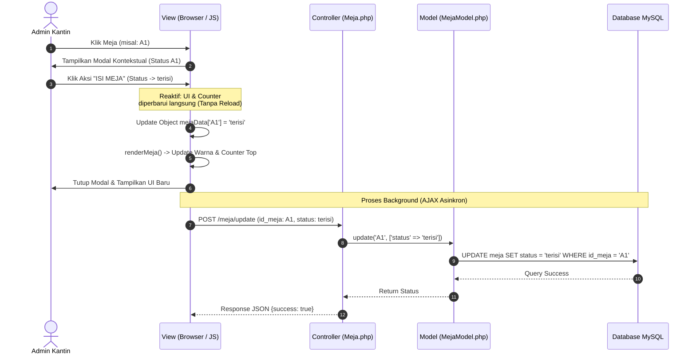
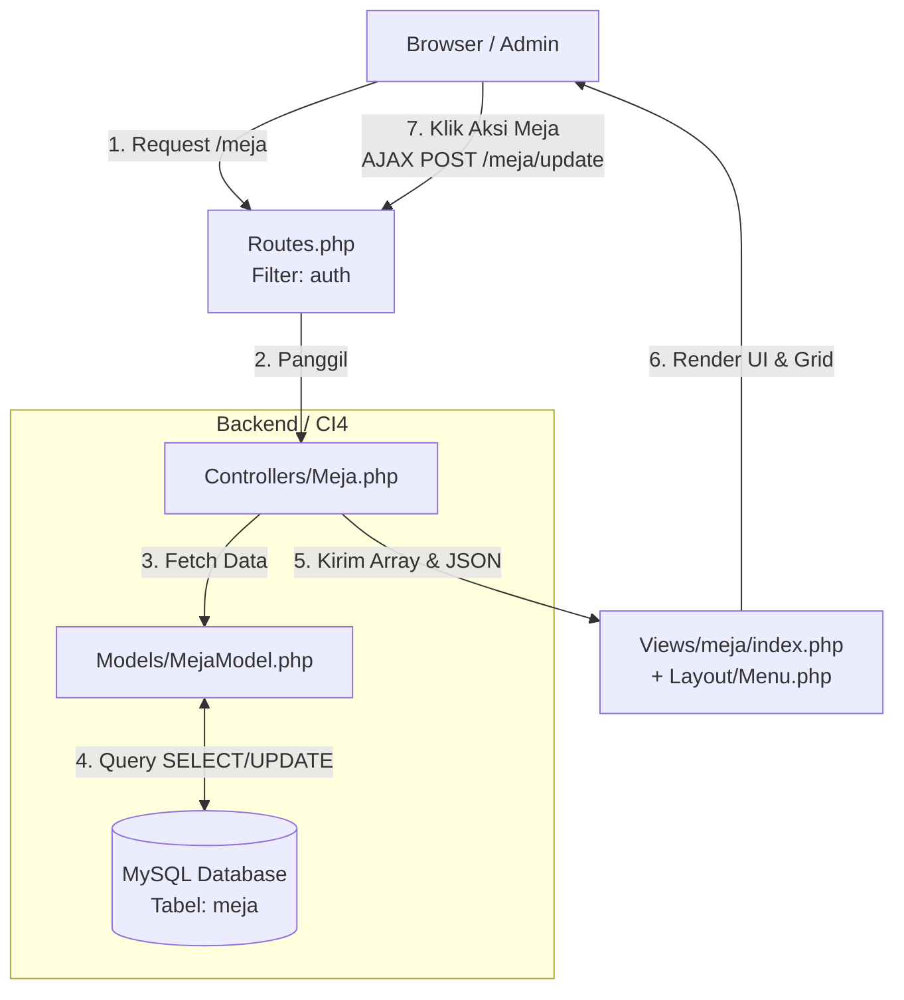

# LAPORAN IMPLEMENTASI FITUR MONITORING MEJA KANTIN (REAL-TIME)
**Proyek:** Sistem Informasi Manajemen Kantin  
**Framework:** CodeIgniter 4 & Bootstrap 5  
**Pendekatan:** Model-View-Controller (MVC) & Reactive DOM Manipulation  

---

## 1. Deskripsi Umum
Fitur **Monitoring Meja Kantin** adalah modul interaktif yang dirancang untuk memudahkan administrator kantin dalam melacak dan mengelola ketersediaan tempat duduk secara *real-time*. Sistem ini mengelola **8 meja operasional (A1–A4 dan B1–B4)** dengan 3 kondisi status utama:
* **Kosong (Tersedia):** Ditandai dengan warna Hijau (*Success*).
* **Booking (Dipesan):** Ditandai dengan warna Kuning (*Warning*).
* **Terisi:** Ditandai dengan warna Merah (*Danger*).

Keunggulan utama dari fitur ini adalah **Logika Interaksi Tanpa Reload (Reactive Counter)**. Ketika admin mengubah status meja melalui *modal pop-up*, antarmuka pengguna (UI) dan angka rekapitulasi (*Top Status Counters*) akan memperbarui secara langsung di sisi *front-end* menggunakan Vanilla JavaScript, sementara sistem di latar belakang (*background*) melakukan sinkronisasi data ke database MySQL menggunakan metode **AJAX (Asynchronous JavaScript and XML)**.

---

## 2. Daftar File yang Diubah
Dalam implementasi fitur ini, dilakukan penambahan file baru dan modifikasi pada file eksisting sesuai dengan standar arsitektur CodeIgniter 4.

| Status | Nama File / Path | Keterangan |
| :--- | :--- | :--- |
| **Modifikasi** | `app/Config/Routes.php` | Menambahkan rute GET untuk halaman meja & rute POST untuk AJAX. |
| **Modifikasi** | `app/Views/Layout/Menu.php` | Menambahkan tautan navigasi "Meja" pada *sidebar* admin. |
| **Baru** | `app/Controllers/Meja.php` | Controller untuk menangani logika tampilan dan proses *update* AJAX. |
| **Baru** | `app/Models/MejaModel.php` | Model untuk berinteraksi dengan tabel `meja` di database. |
| **Baru** | `app/Views/meja/index.php` | Tampilan utama (Grid Meja, Dynamic Counters, Modal, & Script JS). |
| **Baru** | `app/Database/Seeds/MejaSeeder.php` | Seeder untuk mengisi data awal 8 meja (A1–B4) ke database. |
| **Baru** | *Database SQL Query* | DDL & DML untuk pembuatan tabel `meja` melalui Adminer. |

---

## 3. Detail Perubahan per File

### 3.1. Konfigurasi Rute (`app/Config/Routes.php`)
Menambahkan dua rute baru untuk menangani permintaan halaman dan transmisi data asinkron. Filter `'auth'` diterapkan untuk menjamin bahwa fitur hanya dapat diakses oleh pengguna yang telah login.

```php
\(routes->get('/meja', 'Meja::index', ['filter' => 'auth']);\)routes->post('/meja/update', 'Meja::updateStatus', ['filter' => 'auth']);
```

### 3.2. Menu Sidebar (`app/Views/Layout/Menu.php`)
Menambahkan elemen navigasi pada menu samping agar halaman monitoring meja dapat diakses oleh pengguna. Menggunakan fungsi bawaan `site_url()` dan ikon dari Bootstrap Icons.

```html
<li class="nav-item">
    <a class="nav-link" href="<?= site_url('/meja') ?>">
        <i class="bi bi-ui-checks-grid"></i> Meja
    </a>
</li>
```

### 3.3. Controller Meja (`app/Controllers/Meja.php`)
Bertindak sebagai pengontrol logika aliran data. Memiliki dua metode utama:
* **`index()`**: Memanggil `MejaModel`, mengambil seluruh data status meja dari database, memformatnya menjadi struktur key-value (JSON), dan merangkainya dengan layout template (Header, Menu, index, Footer).
* **`updateStatus()`**: Endpoint AJAX yang menerima parameter `id_meja` dan `status` via metode POST, kemudian memperbarui rekor di database secara langsung tanpa me-load ulang halaman.

### 3.4. Model Meja (`app/Models/MejaModel.php`)
Mengonfigurasi komunikasi dengan tabel meja. Karena Primary Key yang digunakan berupa string (A1, B2, dst.), properti `$useAutoIncrement` dinonaktifkan (`false`).

```php
protected \$table            = 'meja';
protected \$primaryKey       = 'id_meja';
protected \$useAutoIncrement = false;
protected \$allowedFields    = ['status'];
```

### 3.5. View Utama & Logika JavaScript (`app/Views/meja/index.php`)
File terintegrasi yang mencakup antarmuka dan logika front-end:
* **Integrasi Data Backend**: Menerima string JSON dari controller dan memetakkannya ke dalam variabel JavaScript (`const mejaData`).
* **Fungsi `renderMeja()`**: Melakukan looping pada objek `mejaData`, menghitung jumlah status secara kontinyu (*auto-counter*), dan menyuntikkan elemen kartu HTML (Bootstrap Card) ke dalam grid layout.
* **Fungsi `openModal(id)`**: Membuka modal kontekstual yang menyesuaikan judul dan indikator warna berdasarkan meja yang diklik.
* **Fungsi `updateTableStatus(newStatus)`**: Mengubah state JS, memicu kalkulasi ulang pada UI, menutup modal, dan menembakkan request AJAX `fetch()` ke controller untuk menyimpan perubahan ke database.

### 3.6. Database & Seeder (`app/Database/Seeds/MejaSeeder.php`)
Skema tabel dibentuk dengan kolom `id_meja` (VARCHAR(10), PK) dan `status` (ENUM('kosong','booking','terisi')). Seeder dibuat untuk melakukan batch insert 8 data meja operasional agar sistem siap digunakan langsung setelah instalasi.

---

## 4. Struktur Antarmuka (UI)

### 4.1. Top Status Counters (Dynamic Indicators)
Terletak di bagian paling atas dasbor, terdiri dari 3 kartu statistik yang menampilkan rekapitulasi data secara real-time:
* **Kartu Hijau (Tersedia)**: Menampilkan total meja berstatus kosong.
* **Kartu Kuning (Dipesan)**: Menampilkan total meja berstatus booking.
* **Kartu Merah (Terisi)**: Menampilkan total meja berstatus terisi.

*Angka ini tidak statis; ia akan bertambah atau berkurang otomatis berbanding lurus dengan aksi yang dilakukan admin pada grid meja.*

### 4.2. Grid Area Meja (Interactive Layout)
Menggunakan sistem Grid Bootstrap (`row g-4` dengan pembagian `col-md-3`) untuk menampilkan 8 kartu meja secara proporsional (4 kolom × 2 baris).
* Setiap kartu mewakili identitas meja (Meja A1 s/d B4).
* Kartu dilengkapi dengan ikon visual (`bi-check-circle`, `bi-clock-history`, atau `bi-x-circle`) dan warna latar yang mencerminkan statusnya saat ini.
* Memberikan efek hover dan bertindak sebagai tombol yang memicu fungsi `openModal()`.

### 4.3. Modal Pop-up Kontekstual (Action Control)
Sistem navigasi aksi menggunakan Bootstrap Modal (`#modalMeja`) yang muncul saat kotak meja diklik:
* **Header Modal**: Menampilkan identitas meja yang terpilih (Contoh: "KONTROL MEJA: A1").
* **Status Saat Ini**: Menampilkan badge dengan status meja tersebut sebelum diubah.
* **Tombol Aksi**: Menyediakan 3 tombol pilihan berdesain outline block (`[ ISI MEJA ]`, `[ BOOKING ]`, dan `[ KOSONGKAN ]`) dengan keterangan yang memandu admin.

### 4.4. Alur Kerja Mekanik UI (Zero-Reload Experience)
1. Pengguna mengklik kotak meja A1 (Status awal: Kosong/Hijau).
2. Modal pop-up muncul.
3. Pengguna mengklik tombol `[ ISI MEJA ]`.
4. JavaScript memperbarui state internal `mejaData['A1'] = 'terisi'`.
5. UI langsung berubah: Meja A1 berubah menjadi warna Merah, label berubah menjadi Terisi.
6. Counter Tersedia berkurang 1 (`Tersedia--`), Counter Terisi bertambah 1 (`Terisi++`).
7. Pop-up tertutup secara halus.

---

## 5. Diagram

### 5.1. Alur Interaksi & Sinkronisasi Data (Sequence Diagram)
Diagram berikut menunjukkan bagaimana interaksi pengguna di front-end diproses seketika tanpa reload, sembari melakukan sinkronisasi secara diam-diam di backend.



### 5.2. Arsitektur MVC pada Fitur Meja
Diagram struktur hubungan antar-file dalam implementasi fitur monitoring meja di CodeIgniter 4.


